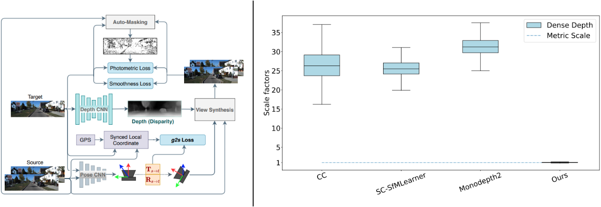

# G2S

This is the official code for ICRA 2021 Paper:  [Multimodal Scale Consistency and Awareness for Monocular Self-Supervised Depth Estimation](https://arxiv.org/abs/2103.02451) by [Hemang Chawla](https://scholar.google.com/citations?user=_58RpMgAAAAJ&hl=en&oi=ao), [Arnav Varma](https://scholar.google.com/citations?user=3QSih2AAAAAJ&hl=en&oi=ao), [Elahe Arani](https://www.linkedin.com/in/elahe-arani-630870b2/) and [Bahram Zonooz](https://scholar.google.com/citations?hl=en&user=FZmIlY8AAAAJ).

G2S (GPS-to-Scale) Loss is a dynamically-weighted loss that can be added to the appearance-based losses to train any monocular self-supervised depth estimation architecture to get scale-consistant and scale-aware depth estimates at inference. 

Here, we provide helper GPS dataloader and the G2S loss classes for using this loss with any model.

For details, please see the [Paper](https://arxiv.org/abs/2103.02451) and [Presentation](https://youtu.be/tIuoqDUcZqs).

## KITTI GPS

The GPS files containing geodesic gps information of raw kitti dataset in local coordinates for training with the g2s loss can be found in the `assets` folder as `kitti_gps_raw.zip`.  
Unzip the file at `/path/to/KITTI/raw_data/sync` to merge the GPS files in the expected directory tree structure.

## Usage

You can use the `G2S` class in `lossG2S.py` within your project for scale-consistent and -aware predictions. 
This requires using the copresent GPS modality along with images.
To load the GPS, please adopt the `GPSDataloader` class within `dataloaderGPS.py` into your images dataloader.  

## Cite Our Work

If you find the code useful in your research, please consider citing our paper:

<pre>
@inproceedings{chawlavarma2021multimodal,
	author={H. {Chawla} and A. {Varma} and E. {Arani} and B. {Zonooz}},
	booktitle={2021 IEEE International Conference on Robotics and Automation (ICRA)},
	title={Multimodal Scale Consistency and Awareness for Monocular Self-Supervised
	Depth Estimation},
	location={Xi’an, China},
	publisher={IEEE (in press)},
	year={2021}
}
</pre>

## License

This project is licensed under the terms of the MIT license.
